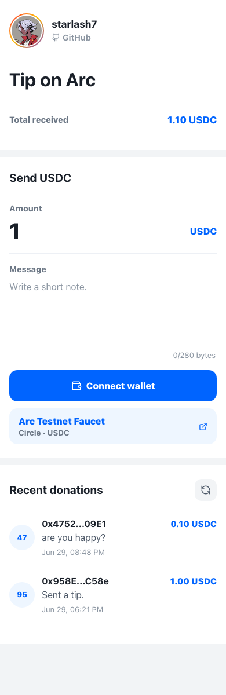

# Tip on Arc

Open-source USDC tip app on Arc Testnet. Anyone can connect a wallet, switch to
Arc Testnet, approve USDC, and send a tip with an optional onchain message.

Live app: https://starlash7.github.io/Tip-on-Arc/



## What It Includes

- Solidity `TipJar` contract for USDC tips and onchain messages.
- Foundry tests and Arc Testnet deployment script.
- Vite React app with wallet connect, Arc Testnet switching, approve, tip,
  total received, Circle Faucet link, and recent donations.
- ABI sync script from Foundry artifacts to the frontend.

## Current Deployment

| Item | Value |
| --- | --- |
| TipJar | `0x8F3301dC24E07F2DF1b9F046C3cCBaadFb4B6E09` |
| Owner | `0x958E30A1ca10818684FAE309136E702751CcC58e` |
| App | `https://starlash7.github.io/Tip-on-Arc/` |

## Arc Testnet Values

| Item | Value |
| --- | --- |
| Chain ID | `5042002` |
| RPC | `https://rpc.testnet.arc.network` |
| Explorer | `https://testnet.arcscan.app` |
| USDC ERC-20 interface | `0x3600000000000000000000000000000000000000` |
| Circle Faucet | `https://faucet.circle.com/` |

Arc uses USDC as the native gas token. The contract and frontend use the Arc
USDC ERC-20 interface with 6 decimals for `approve`, `transferFrom`, and amount
formatting.

## Quick Start

```sh
npm install
cp .env.example .env
npm run dev
```

Set `VITE_TIPJAR_ADDRESS` in `.env` after deploying a contract.

## Deploy to Arc Testnet

Install Foundry if needed:

```sh
curl -L https://foundry.paradigm.xyz | bash
foundryup
```

Create and fund a deployment wallet with Arc Testnet USDC from the Circle
Faucet:

```sh
cast wallet new
```

Set environment variables:

```sh
export ARC_TESTNET_RPC_URL=https://rpc.testnet.arc.network
export PRIVATE_KEY=0xYOUR_PRIVATE_KEY
export USDC_ADDRESS=0x3600000000000000000000000000000000000000
```

Deploy:

```sh
npm run deploy:arc
```

Set the frontend contract address:

```sh
VITE_TIPJAR_ADDRESS=0xYOUR_DEPLOYED_TIPJAR_ADDRESS
```

## Withdraw Tips

Only the owner can withdraw the contract's USDC balance:

```sh
cast send $VITE_TIPJAR_ADDRESS "withdraw()" \
  --rpc-url $ARC_TESTNET_RPC_URL \
  --private-key $PRIVATE_KEY
```

## Frontend Deployment

Build the static app with `VITE_TIPJAR_ADDRESS` set:

```sh
npm run build
```

Deploy the `dist/` directory to any static host. For GitHub Pages under this
repo path, build with:

```sh
VITE_BASE_PATH=/Tip-on-Arc/ npm run build
```

## Contract API

- `tip(uint256 amount, string message)` transfers USDC from the sender and
  stores sender, amount, message, and timestamp. Messages are capped at
  280 bytes.
- `getTips()` returns all stored tip records.
- `getTotalTipped()` returns cumulative tipped USDC amount.
- `withdraw()` lets the owner withdraw all USDC held by the contract.

## Safety Notes

- This is a testnet project, not audited production code.
- Never commit a real private key or funded `.env` file.
- Testnet USDC has no real-world value.
- `getTips()` returns the full onchain array for v1 simplicity. For larger
  deployments, index the `Tipped` event instead.

## License

MIT
