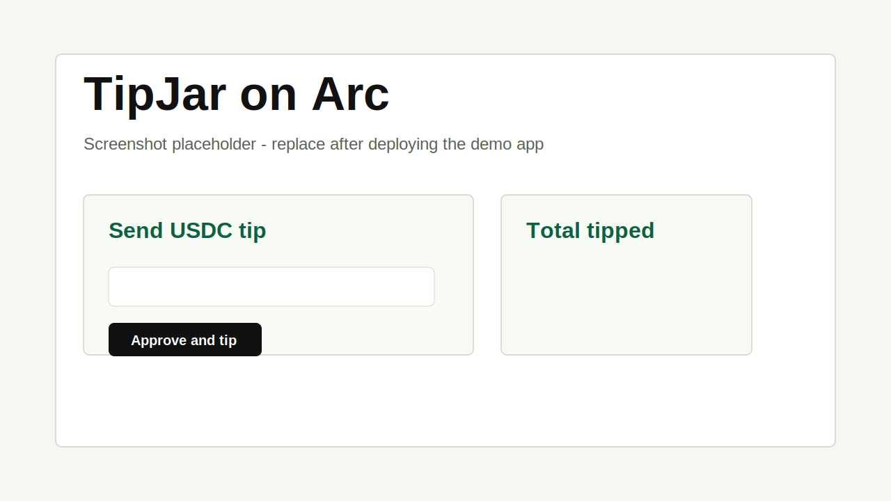

# TipJar on Arc

Open-source USDC TipJar template for Arc Testnet. Anyone can send a USDC tip with
an optional onchain message; the contract stores every tip record and lets the
owner withdraw collected USDC.

## What It Includes

- Solidity `TipJar` contract that accepts Arc USDC through the ERC-20 interface.
- Foundry tests and Arc Testnet deployment script.
- Vite React app for wallet connect, USDC approval, tipping, total raised, and
  recent tip records.
- ABI sync script so the frontend uses the compiled Foundry artifact.

## Arc Testnet Values

| Item | Value |
| --- | --- |
| Chain ID | `5042002` |
| RPC | `https://rpc.testnet.arc.network` |
| Explorer | `https://testnet.arcscan.app` |
| USDC ERC-20 interface | `0x3600000000000000000000000000000000000000` |

Arc uses USDC as the native gas token. For `approve`, `transferFrom`,
`balanceOf`, and frontend amount parsing, this project uses the Arc USDC ERC-20
interface with 6 decimals.

## Quick Start

Install dependencies:

```sh
npm install
```

Run contract and frontend checks:

```sh
npm test
npm run build
```

Start the local app:

```sh
cp .env.example .env
npm run dev
```

The app needs `VITE_TIPJAR_ADDRESS` after you deploy the contract.

## Deploy to Arc Testnet

Install Foundry if needed:

```sh
curl -L https://foundry.paradigm.xyz | bash
foundryup
```

Create a deployment wallet, then fund it with Arc Testnet USDC from the Circle
Faucet. USDC pays both gas and tips on Arc.

```sh
cast wallet new
```

Set environment variables:

```sh
export ARC_TESTNET_RPC_URL=https://rpc.testnet.arc.network
export PRIVATE_KEY=0xYOUR_PRIVATE_KEY
export USDC_ADDRESS=0x3600000000000000000000000000000000000000
```

Deploy:

```sh
npm run deploy:arc
```

Copy the deployed contract address into `.env`:

```sh
VITE_TIPJAR_ADDRESS=0xYOUR_DEPLOYED_TIPJAR_ADDRESS
```

Then run:

```sh
npm run dev
```

## Withdraw Tips

Only the deployment owner can withdraw. The command transfers the contract's
entire USDC balance to the owner:

```sh
cast send $VITE_TIPJAR_ADDRESS "withdraw()" \
  --rpc-url $ARC_TESTNET_RPC_URL \
  --private-key $PRIVATE_KEY
```

## Frontend Deployment

Build the static app:

```sh
npm run build
```

Deploy the `dist/` directory to any static host. Set this environment variable
in the host before building:

```sh
VITE_TIPJAR_ADDRESS=0xYOUR_DEPLOYED_TIPJAR_ADDRESS
```

Demo link placeholder: `https://your-tipjar-demo.example`

Screenshot placeholder:



## Contract API

- `tip(uint256 amount, string message)` transfers USDC from the sender and
  stores sender, amount, message, and timestamp. Messages are capped at
  280 bytes.
- `getTips()` returns all stored tip records.
- `getTotalTipped()` returns cumulative tipped USDC amount.
- `withdraw()` lets the owner withdraw all USDC held by the contract.

## Safety Notes

- This is a testnet template, not audited production code.
- Never commit a real private key or funded `.env` file.
- Testnet USDC has no real-world value.
- `getTips()` returns the full onchain array for v1 simplicity. For large public
  deployments, index the `Tipped` event instead of relying on unbounded reads.

## License

MIT
